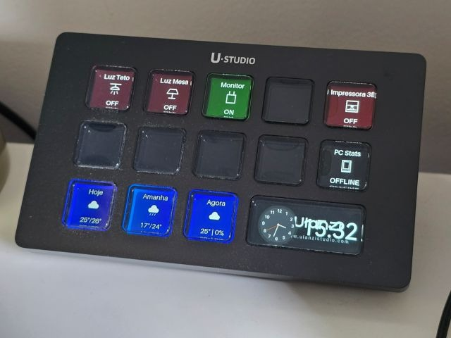

# Custom Ulanzi D200 Stream Deck + Philips Hue Integration



This project is a highly customizable, local Python-based controller for the **Ulanzi D200 Stream Controller**, integrating directly with your local **Philips Hue REST API**. It allows the physical tactile LCD keys of the D200 to:
1.  Toggle Philips Hue lights and smart plugs.
2.  Adjust light brightness.
3.  Display real-time states ("ON", "OFF", brightness %) dynamically drawn over custom PNG icons with solid color status backgrounds.
4.  Render a background digital clock widget ("HH:MM") updating in real time based on customizable timezone configuration.
5.  Render real-time geometric Weather widgets (for Today and Tomorrow) with caching and tap-to-force-refresh.
6.  Display Windows PC telemetry statistics (CPU, GPU, RAM, and Disk) with smooth 5-second slide carousel rotations.

For developers and off-grid testing, the application includes a robust **Simulator Mode** that allows you to emulate button clicks from your console and writes visual screens directly to a local directory for preview.

---

## 💡 Motivation & Purpose

The primary goal of this project is to connect the **Ulanzi D200 Stream Controller** directly to a **dedicated Linux server** as a standalone home automation and telemetry hub.

By running the controller on a dedicated server rather than a primary workstation (PC or Mac):
* **Centralized Operation:** Home appliances, lights, and smart plugs are managed 24/7 without requiring a personal desktop or laptop to remain powered on.
* **Autonomous Controller:** The Stream Deck operates independently as an always-on physical smart control panel and desk widget.
* **Future Remote Control:** It lays the groundwork to remotely power on, monitor, and execute commands on both Windows PC and Mac workstations from a single, centralized Linux server hub.

## 📂 Repository Structure

The project is split into specialized subdirectories to keep server logic cleanly decoupled from clients:
*   `server/`: Contains all server-side python services, configurations, verification test suites, and virtual environments running on the Linux host.
*   `clients/windows/`: Contains Windows-side telemetry scripts (kept for historical client-push compatibility).
*   `tasks/`: Checklists, lessons learned, and design artifacts.

---

## 🛠️ Setup Instructions (Linux Server)

### 1. Environment and Packages
This project is built using Python 3.9+. Navigate to the `server/` subdirectory to configure your local virtual environment:

```bash
# Navigate to the server folder
cd server

# Initialize virtual environment
python3.9 -m venv venv

# Activate virtual environment
source venv/bin/activate

# Install requirements
pip install -r requirements.txt
```

---

### 2. Philips Hue Bridge Configuration
To control your lights, you need to configure the local network bridge connection.

1.  **Find your Hue Bridge IP Address:** You can find it on your router's client list or via `https://discovery.meethue.com`.
2.  **Generate a Developer Username (API Key):**
    *   Press the physical link button in the center of your **Hue Bridge**.
    *   Within 30 seconds, run the following `curl` command in your terminal, replacing `<BRIDGE_IP>` with your bridge's IP:
    ```bash
    curl -X POST -H "Content-Type: application/json" \
         -d '{"devicetype":"ulanzi_streamdeck#linux"}' \
         http://<BRIDGE_IP>/api
    ```
    *   The bridge will return a JSON response containing a generated `username` string (this is your API Key). Keep this private.

---

### 3. Environment Secrets (.env)
Create a `.env` file inside the `server/` directory by copying the example:

```bash
cd server
cp .env.example .env
```

Edit the `server/.env` file and input your settings:
```env
HUE_BRIDGE_IP=192.168.1.100
HUE_USERNAME=your_generated_api_username
SIMULATOR_MODE=True  # Set to False to communicate with physical D200 hardware
TIMEZONE=America/Sao_Paulo  # Configure your preferred local timezone
```

---

### 4. USB Permissions on Linux (udev Rules)
To run this application as a non-root user (without `sudo`), you must grant your user permissions to access the D200 USB device.

1.  Plug in your D200 via USB.
2.  Run `lsusb` in your terminal to find the device's Vendor ID and Product ID:
    ```bash
    lsusb
    # Example output showing: Bus 001 Device 004: ID 2207:0018
    # 2207 is the Vendor ID (idVendor), 0018 is the Product ID (idProduct)
    ```
3.  Create a custom udev rule:
    ```bash
    sudo nano /etc/udev/rules.d/99-ulanzi-d200.rules
    ```
4.  Add the following line, replacing `2207` and `0018` with the actual Vendor/Product IDs from `lsusb`:
    ```udev
    SUBSYSTEMS=="usb", ATTRS{idVendor}=="2207", ATTRS{idProduct}=="0018", MODE="0666", GROUP="plugdev"
    ```
5.  Reload the udev rules:
    ```bash
    sudo udevadm control --reload-rules
    sudo udevadm trigger
    ```

---

## 🖥️ PC Performance Monitoring Telemetry (HTTP Pull via LibreHardwareMonitor)

The Stream Deck features a premium performance monitoring widget that displays real-time statistics of your Windows PC (CPU load & temp, GPU load & temp, RAM usage, and Disk storage load) directly on button index 9, rotating through a carousel every 5 seconds.

Instead of running heavy Python or binary clients on Windows, this project uses a high-performance **HTTP Pull** architecture. The Linux daemon periodically polls the integrated JSON API of **LibreHardwareMonitor** running on your Windows PC.

### 1. Windows PC Configuration

To enable telemetry polling from the Linux host:

1. **Activate the LHM Web Server:**
   * Open **LibreHardwareMonitor** on your Windows PC.
   * Go to **Options** $\rightarrow$ **Web Server** $\rightarrow$ click **Run**.
   * *(Optional)* Go to **Options** $\rightarrow$ **Web Server** $\rightarrow$ **Port** to verify the port is set to `8085` (or modify `pc_monitor_port` in `config.yaml` to match).

2. **Open the Windows Firewall Port:**
   * Open **PowerShell** as **Administrator** on Windows and run this command to allow the Linux Stream Deck to reach the LHM JSON API:
     ```powershell
     New-NetFirewallRule -DisplayName "LibreHardwareMonitor WebServer" -Direction Inbound -Action Allow -Protocol TCP -LocalPort 8085
     ```

### 2. Stream Deck Configuration (`server/config.yaml`)

Update the global settings in `server/config.yaml` to configure LHM Pull mode:

```yaml
pc_monitor_mode: "pull"          # Set to "pull" to use LibreHardwareMonitor API
pc_monitor_ip: "192.168.31.101" # Set to the local network IP address of your Windows PC
pc_monitor_port: 8085            # The web server port (default: 8085)
```

### 3. How the WMI Path Parser Works
The Linux Stream Deck server contains a highly robust, recursive path-based WMI tree parser (`find_sensor_by_path`). Because hardware component names vary across systems (e.g., `"Intel Core i9-13900K"`, `"AMD Ryzen 9 7950X"`, `"NVIDIA GeForce RTX 4090"`), the parser scans the telemetry payload using extensive vendor keyword fallbacks:
*   **CPU statistics:** Scans for keywords like `intel`, `amd`, `core`, `ryzen`, `cpu`, or `processor` on the first hierarchical level to resolve `cpu package` temperature and `cpu total` load across any architecture.
*   **GPU statistics:** Resolves core temperatures and load percentages for NVIDIA Geforce/RTX (keywords `nvidia`, `geforce`, `rtx`) and AMD Radeon (keywords `radeon`).
*   **RAM & Storage:** Traverses generic memory loads and active SSD/HDD/Disk storage capacities.
*   **Offline Fallback:** If the Windows PC is powered off or unreachable for more than 15 seconds, the Stream Deck button automatically falls back to a solid dark-red display labeled **OFFLINE**, keeping the daemon completely crash-free.

---

## 🚀 Running the Application

Always navigate to the `server/` directory before running command tools:

```bash
cd server
```

### Verification Suite
Run the automated test suite to verify configuration formatting, Pillow image drawing, screen sleep schedules, clock timezones, and the recursive LHM WMI telemetry parser:
```bash
./venv/bin/python verify.py
```

### Main Application
Run the Stream Deck application runner (automatically bootstraps venv, requirements, and launches in physical or simulator mode):
```bash
./run.sh
```

#### Console Keyboard Interface (Simulator Mode)
When `SIMULATOR_MODE=True` is enabled, the program launches an interactive console. 
*   **Trigger Keypress:** Type any mapped button index (e.g., `0`, `1`, `2`) and press `Enter` to simulate physical button clicks!
*   **Preview Renderings:** Check the `server/output_sim/` directory. You will see visual files like `button_0.png` updating dynamically to show exactly what would render on the physical LCD screens!
*   **Clock interaction:** Clicking the clock key temporarily renders the current Date (`DD/MM`) for 3 seconds before automatically reverting to time (`HH:MM`).
*   **Quit:** Type `q`, `exit`, or press `Ctrl+C` to shut down gracefully.

---

## 🖥️ Systemd Daemon Service Management (Root Directory)

You can manage the background runner daemon directly from the repository root:
*   **Start & Enable Service:** Run `./start_service.sh` (installs and starts the systemd service to run on Linux boot).
*   **Stop & Disable Service:** Run `./stop_service.sh` (stops and disables the background systemd service).

---

## 🙏 Credits & Acknowledgements

This project makes use of the following awesome open-source projects and libraries:

*   **[`strmdck`](https://pypi.org/project/strmdck/)**: Python library for communication and hardware interface with the Ulanzi D200 Stream Controller.
*   **[LibreHardwareMonitor](https://github.com/LibreHardwareMonitor/LibreHardwareMonitor)**: Open-source software for monitoring CPU, GPU, RAM, and Disk performance telemetry.
*   **[Philips Hue API](https://developers.meethue.com/)**: Local REST API for Philips Hue bridge and smart device control.
*   **[Pillow (PIL)](https://python-pillow.org/)**: Python Imaging Library used for real-time dynamic key screen rendering.
*   **[Google Antigravity](https://deepmind.google/) & [Google Gemini](https://gemini.google.com/)**: AI pair programming platform and models used to architect, build, debug, and document this codebase.

---

*Built with ❤️ using **Google Antigravity** & **Google Gemini**.*
